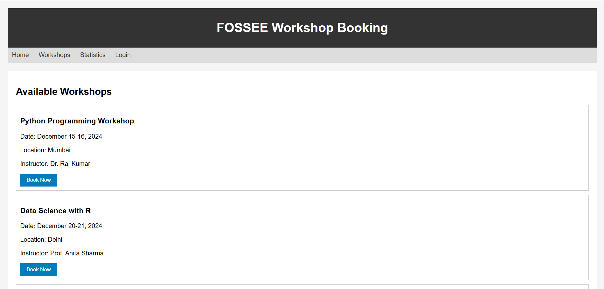
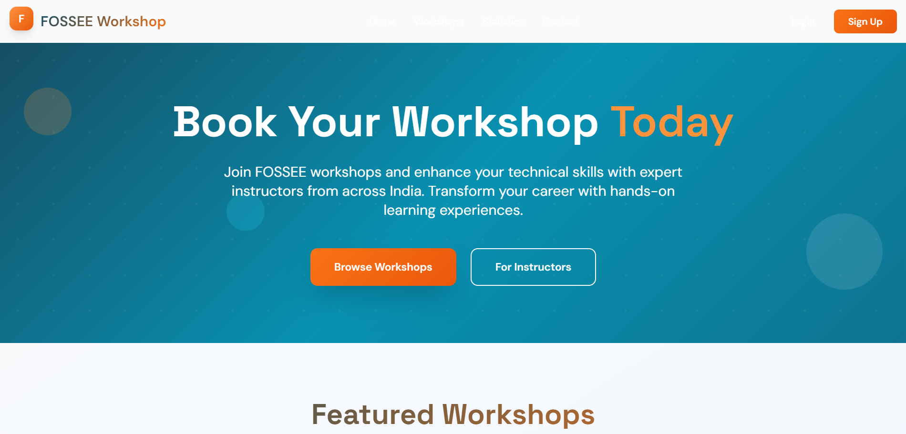

# FOSSEE Workshop Booking Site

A landing page for booking technical workshops. Built as a static site with vanilla HTML, CSS, and JavaScript.

## Before and After Comparison

### What Changed

| Aspect | Before | After |
|--------|--------|-------|
| **Header** | Plain black bar with white text | Gradient header with logo, better navigation, and blur effect |
| **Hero Section** | Missing - went straight to workshop list | Full hero section with compelling headline and call-to-action buttons |
| **Layout** | Simple list format, basic borders | Card-based design with proper spacing and visual hierarchy |
| **Colors** | Basic black/white with blue buttons | Modern gradient backgrounds (teal/cyan) with orange accents |
| **Typography** | Default system fonts | Custom Google Fonts (Space Grotesk + DM Sans) for better readability |
| **Visual Interest** | Flat, minimal styling | Gradients, shadows, floating elements, and depth |
| **Branding** | Text-only header | Logo with floating animation and consistent brand colors |
| **User Experience** | Basic functionality | Engaging animations, better information hierarchy |

## Live Demo
The site runs at `127.0.0.1:5500/workshop_booking/ui-development/after.html` (based on your local setup)

## What it does
- Shows available workshops with dates and locations
- Lets users book workshops through a modal form
- Works on mobile and desktop
- Has a contact form

## Tech used
- HTML5
- CSS3 (with Tailwind from CDN)
- Vanilla JavaScript
- Google Fonts (Space Grotesk, DM Sans)

## Key features I implemented

### Responsive design
I used CSS Grid for the workshop cards and made sure everything scales down for mobile. The navigation becomes a hamburger menu on smaller screens.

### Booking modal
When you click "Book Now", a modal pops up with a form. I handled the form state and validation with vanilla JS instead of using a framework.

### Animations
Added CSS transitions for hover effects and page scroll animations. Used `transform` instead of changing layout properties for better performance.

## Design decisions I made

**Colors and styling:**
- Went with a blue/teal primary color and orange accents
- Used glassmorphism effects (backdrop-blur) for modern look
- Added gradients and subtle shadows

**Layout:**
- Mobile-first approach - designed for phone screens first, then scaled up
- Three-column grid for workshop cards on desktop, single column on mobile
- Sticky header that gets a blur effect when scrolling

**Performance vs visuals:**
- Used CSS animations instead of JavaScript where possible
- Loaded fonts from Google Fonts CDN
- Kept JavaScript minimal - only used it for modal, mobile menu, and smooth scrolling

## Problems I ran into

**Cross-browser backdrop-filter:**
Backdrop-blur doesn't work in all browsers. I added fallbacks with solid background colors for older browsers.

**Modal focus management:**
Had to prevent background scrolling when modal is open and make sure keyboard navigation works properly.

**Mobile menu animation:**
Getting smooth slide-in animation that works on slower phones took some tweaking with CSS transforms.

## How to run locally

1. Just open the HTML file in a browser - no build process needed
2. For development, use Live Server extension in VS Code or similar

## What could be improved

- Connect to a real backend instead of just showing alerts on form submit
- Add proper form validation with error messages
- Make the workshop data dynamic instead of hardcoded
- Add loading states for better UX
- Optimize images (currently using placeholder data)

## Browser support
Works in modern browsers. Gracefully degrades in older ones (backdrop-blur falls back to solid backgrounds).

All CSS and JavaScript is inline in the HTML file to keep it simple.
